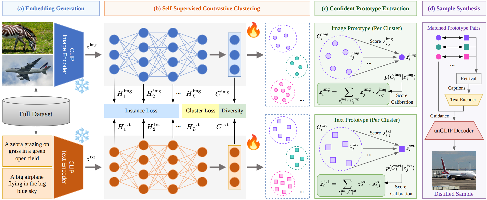

# Multimodal Dataset Distillation via Self-Supervised Contrastive Learning with Confident Prototype Synthesis



## Abstract 
Multimodal Dataset Distillation (MDD) aims to condense a large-scale image-text dataset into a compact surrogate. Unlike unimodal Dataset Distillation (DD), MDD requires extracting synergistic knowledge from heterogeneous sources. Recently, prototype-guided data synthesis has emerged as a promising paradigm, demonstrating superior efficiency and cross-architecture generalization. However, the existing prototype-guided method decouples the clustering process across modalities and relies on naive intra-cluster averaging for prototype synthesis. Such a strategy is prone to triggering cross-modal semantic drift due to the inherent modality gap, while simultaneously neglecting the semantic reliability of intra-cluster samples. To address these issues, we propose SCCP, a novel framework that learns a joint latent projection space that better aligns image and text representations through hierarchical self-supervised contrastive objectives and synthesizes reliable prototypes in a confidence-aware manner. Specifically, SCCP captures dual-level semantic correlations from both the feature and cluster levels, achieving fine-grained cross-modal alignment. Furthermore, SCCP utilizes the semantic scores calculated from the clustering head for confidence-weighted prototype synthesis, generating prototypes with stronger semantic representativeness. Extensive experiments on Flickr30K and MS-COCO across various distillation scales demonstrate that SCCP achieves higher distillation quality, outperforming the state-of-the-art prototype-guided method.
## Installation
Use conda environment found in `environment.yaml`
```
conda env create -f environment.yaml
conda activate sccp
```


## Datasets

Download the Flickr30K 
[[Train](https://storage.googleapis.com/sfr-vision-language-research/datasets/flickr30k_train.json)]
[[Val](https://storage.googleapis.com/sfr-vision-language-research/datasets/flickr30k_val.json)]
[[Test](https://storage.googleapis.com/sfr-vision-language-research/datasets/flickr30k_test.json)]
[[Images](https://www.kaggle.com/datasets/hsankesara/flickr-image-dataset)]
and MS-COCO
[[Train](https://storage.googleapis.com/sfr-vision-language-research/datasets/coco_karpathy_train.json)]
[[Val](https://storage.googleapis.com/sfr-vision-language-research/datasets/coco_karpathy_val.json)]
[[Test](https://storage.googleapis.com/sfr-vision-language-research/datasets/coco_karpathy_test.json)]
[[Images](https://cocodataset.org/#download)]
datasets. 

Place the downloaded images and annotation JSON files as follows:

```
./data/datasets/
├── Flickr30k/
│   ├── flickr30k-images/
│   │   ├── 0.jpg
│   │   ├── 1.jpg
│   │   └── ...
│   ├── flickr30k_train.json
│   ├── flickr30k_val.json
│   └── flickr30k_test.json
└── COCO/
    ├── train2014/
    ├── val2014/
    ├── test2014/
    ├── coco_karpathy_train.json
    ├── coco_karpathy_val.json
    └── coco_karpathy_test.json
```

## Run

### Flickr30K
To distill the Flickr30K dataset into 100 pairs and evaluate the distilled dataset, use the following scripts:

```
python sccp_distill.py --mode distill --dataset flickr --data_root './data/datasets/Flickr30k' --num_pairs 100
python sccp_distill.py --mode eval --dataset flickr --data_root './data/datasets/Flickr30k' --num_pairs 100
```

### MS-COCO
To distill the MS-COCO dataset into 100 pairs and evaluate the distilled dataset, use the following scripts:

```
python sccp_distill.py --mode distill --dataset coco --data_root './data/datasets/COCO' --num_pairs 100  
python sccp_distill.py --mode eval --dataset coco --data_root './data/datasets/COCO' --num_pairs 100
```


## Acknowledgments
This codebase is built upon the following repositories: [PDS](https://github.com/junhyeok9712/PDS), [LoRS](https://github.com/silicx/LoRS_Distill). We sincerely thank these works for their open-source contributions.

